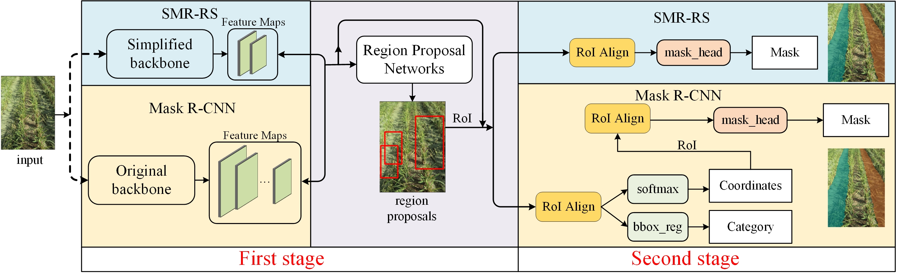
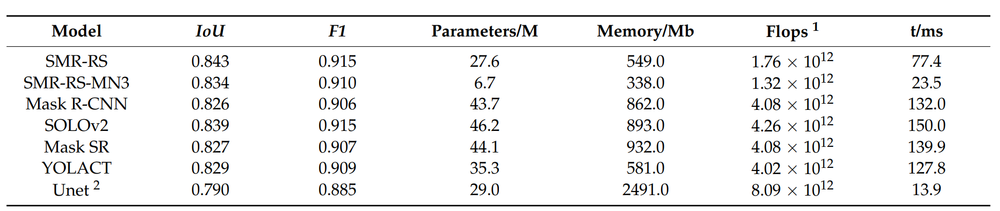
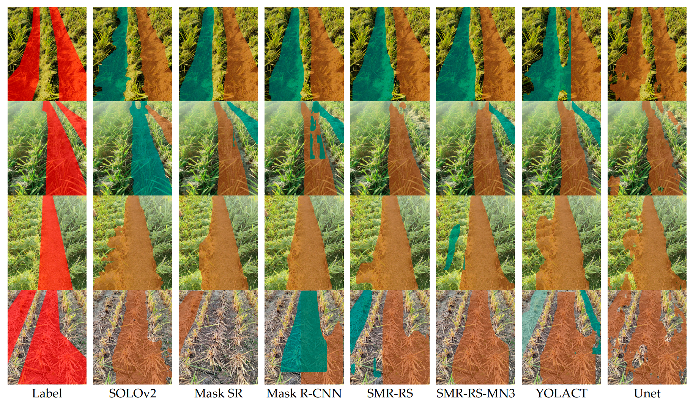

# SMR-RS:一个专门用于稻茬行分割的简化版Mask R-CNN神经网络模型
`首先欢迎来到我的仓库 :clap: :clap: :clap:这是我的第一个仓库。:sunglasses:`
## 项目简介
正如标题所述,这是一个介绍深度学习模型的项目，这个模型用于对稻茬行图片进行实例分割，模型名字叫[SMR-RS](https://www.mdpi.com/2076-3417/13/16/9136 "论文地址")，模型代码是基于[mmdetection](https://github.com/open-mmlab/mmdetection "mmdetection")的1.x版本，我把仅需要用到的代码给剔除了出来，所以即使你不安装也能运行，但是需要额外下载[requirements.txt](/requirements.txt)中的依赖包，由于这是本人做的第一个项目，可能存在一些意想不到的bug，如果存在疑问，[请联系我](2812344948@qq.com "2812344948@qq.com")。
### SMR-RS模型介绍
本模型的代码是在[mmdetection](https://github.com/open-mmlab/mmdetection "mmdetection")里的[Mask R-CNN](https://arxiv.org/pdf/1703.06870)的基础上修改得来的，与原来的代码相差不大，只有几处小改动，但是两个模型的效果发生了很大的变化。另外我对模型运行过程中的每一步代码几乎都做了注释，如果你知道[mmdetection](https://github.com/open-mmlab/mmdetection "mmdetection")里的[Mask R-CNN](https://arxiv.org/pdf/1703.06870)模型运行的[入口](RRdet\model\detectors\two_stage.py)的话，顺着这个入口一路看下去，你会发现我写了大量的注释，当然这些注释有些许粗糙。

***接下来介绍我的模型和Mask R-CNN的差异***  
**以下面这张图片来介绍：** 

SMR-RS和Mask R-CNN都是两阶段模型，有**First-stage**和**Second-stage**，相比于Mask R-CNN，SMR-RS在第一阶段对特征图(Feature Maps)进行了精简，去掉了不必要的特征图;在第二阶段，rpn输出的提议框(region proposals)输入给**ROi Align**后直接生成掩膜，省去了分类的阶段，这么做的原因是我所需要分割的目标只有稻茬行，而分类阶段是把提议框细分成各种不同类，我不需要，故省去。  

**下面这两张图展示了SMR-RS和其他模型的对比：**
**评价指标对比:** 

**推理结果图片对比:** 
