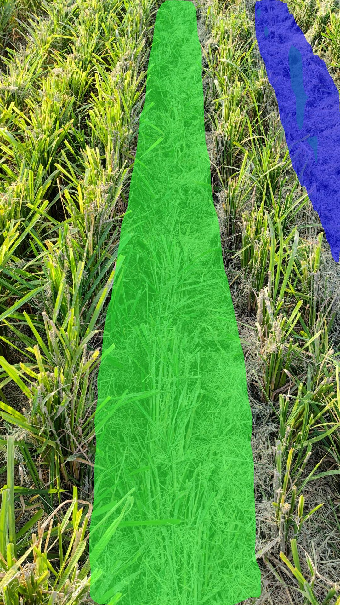
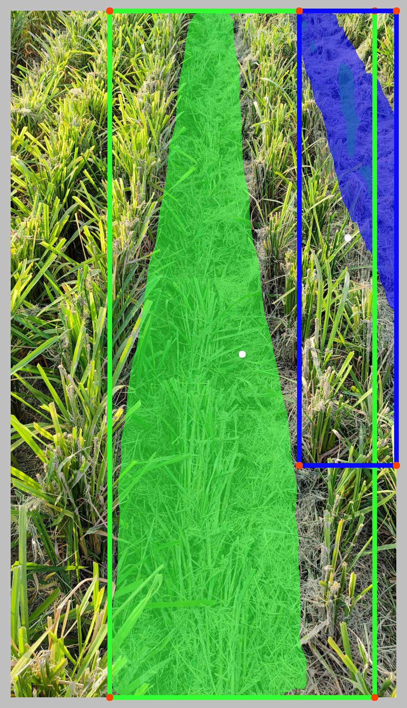

# SMR-RS:一个专门用于稻茬行分割的简化版Mask R-CNN神经网络模型
首先欢迎来到我的仓库 :clap: :clap: :clap: 这是我的第一个仓库 :sunglasses:
## 项目简介
正如标题所述,这是一个介绍深度学习模型的项目，这个模型用于对稻茬行图片进行实例分割，模型名字叫[SMR-RS](https://www.mdpi.com/2076-3417/13/16/9136 "论文地址")，模型代码是基于[mmdetection](https://github.com/open-mmlab/mmdetection "mmdetection")的1.x版本，我把仅需要用到的代码给剔除了出来，所以即使你不安装也能运行，但是需要额外下载[requirements.txt](/requirements.txt)中的依赖包，由于这是本人做的第一个项目，可能存在一些意想不到的bug，如果存在疑问，[请联系我](2812344948@qq.com "2812344948@qq.com")。
### SMR-RS模型介绍
本模型的代码是在[mmdetection](https://github.com/open-mmlab/mmdetection "mmdetection")里的[Mask R-CNN](https://arxiv.org/pdf/1703.06870)的基础上修改得来的，与原来的代码相差不大，只有几处小改动，但是两个模型的效果发生了很大的变化。另外我对模型运行过程中的每一步代码几乎都做了注释，如果你知道[mmdetection](https://github.com/open-mmlab/mmdetection "mmdetection")里的[Mask R-CNN](https://arxiv.org/pdf/1703.06870)模型运行的[入口](RRdet\model\detectors\two_stage.py)的话，顺着这个入口一路看下去，你会发现我写了大量的注释，当然这些注释有些许粗糙。

***接下来介绍我的模型和Mask R-CNN的差异***  
**以下面这张图片来介绍：** 

SMR-RS和Mask R-CNN都是两阶段模型，有**First-stage**和**Second-stage**，相比于Mask R-CNN，SMR-RS在第一阶段对特征图(Feature Maps)进行了精简，去掉了不必要的特征图;在第二阶段，rpn输出的提议框(region proposals)输入给**ROi Align**后直接生成掩膜，省去了分类的阶段，这么做的原因是我所需要分割的目标只有稻茬行，而分类阶段是把提议框细分成各种不同类，我不需要，故省去。  
**更详细的信息请参考[SMR-RS](https://www.mdpi.com/2076-3417/13/16/9136 "SMR-RS")**
## 代码介绍
### 1. **[gene_anchor_demo.py](gene_anchor_demo.py)**   
> 该文件的作用是展示锚框的生成过程，这些代码都是从***Mask R-CNN***代码中抽出来的,仅仅包括锚框的生成，不必要的都删掉了。    
**运行前需要填写锚框的基本设置：**
```Python
        #以下均为默认参数
        #要把锚框绘制到哪张图片上
        imgDir = 'demo/test/00.jpg'

        #填写该图片的尺寸信息
        image_heigt=1920
        image_width=1080

        #设置锚框的要生成锚框的基本信息
        scales=[100],#锚框面积
        ratios=[0.5,1,2],#锚框比例
        strides=[4, 8, 16, 32]#不同特征图上锚框分布的间距,要和特征图的个数相同

        #设置输入rpn中特征图的大小，一个元组代表一个特征图
        featmap_sizes = [(270, 480),(135, 24),(68, 120),(34, 60)]
        #显示多少个锚框
        num_choices=10
```
> ***不同参数的运行结果如下:***       

|ratios=[0.5,1,2]，其他为默认值|scales=[200]其他为默认值|strides=[8,16,32,64]，其他为默认值|
|:------------:|:----------:|:------------:|
||||        

> ### 2. **[inference_demo.py](inference_demo.py)**   
> 模型推理展示代码，需要使用到[配置文件](./configs/infer_cfg/ "训练配置文件")以及加载[模型权重](#权重文件下载)，主要包括以下三个函数:   
> * data_demo，展示加载数据集的方法，以及输出单帧数据的基本信息
> * backbone_neck_Demo，展示主干网络和颈部网络输出的张量的尺寸
> * show_anchors_proposal，展示推理的结果，其中包括中间过程的结果和最终结果。
 
**该函数在默认参数下的输出结果如下所示:**   

|提议框对应的锚框|提议框|第一个掩膜和边框|第二个掩膜和边框|所有掩膜|所有掩膜和边框|
|:------------: |:---------------:|:-----:|:---------------:|:-----:|:-----:|
|   |   |  | | | |

> ### 3. **[inference_demo.py](train_user.py)**  
训练模型的代码，训练方法和***mmdetection***相同，此为最小代码版本。需要使用到Config文件，本项目已经提供了[训练配置文件](./configs/train_cfg/ "训练配置文件")。

### 权重文件下载
**正在上传中，敬请期待。**
### SMR-RS v2
改进版本的SMR-RS，使用了更先进的损失函数，更改了学习率策略，具体请参考[配置文件](configs/infer_cfg/SMRv2/my_custom_config_simple_v2_01.py "SMR-RS v2")。


